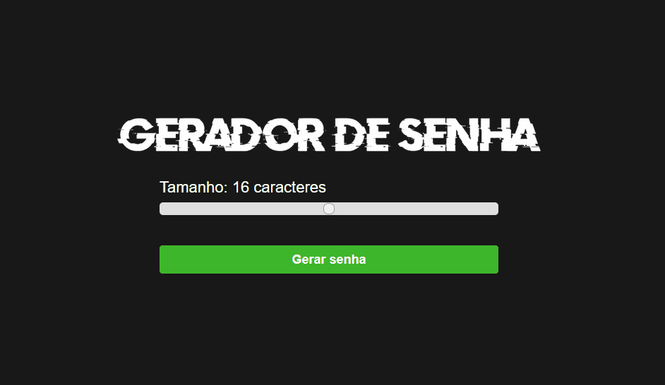

 <h1 align="center"> 🔒 Gerador de senhas </h1>

Gerador de senhas usando HTML, CSS e JavaScript.

 

  <a href="#-tecnologias">Tecnologias</a>&nbsp;&nbsp;&nbsp;|&nbsp;&nbsp;&nbsp;
  <a href="#-projeto">Sobre o projeto</a>&nbsp;&nbsp;&nbsp;|&nbsp;&nbsp;&nbsp;
  <a href="#-aprendizados">Aprendizados</a>&nbsp;&nbsp;&nbsp;|&nbsp;&nbsp;&nbsp;
  <a href="#-contato">Contato</a>&nbsp;&nbsp;&nbsp;&nbsp;&nbsp;&nbsp;

 

  

  

## 🚀 Tecnologias

- HTML e CSS
- JavaScript
- Git e Github

 

## 💻 Projeto

O projeto funciona através de um algoritmo que gera uma nova senha toda vez que o usuário clicar no botão *gerar senha.*

O gerador possibilita ao usuário escolher o tamanho da senha (de 8 à 24 caractéres) que ele quer gerar, através de um slider.

Além disso, o usuário encontra uma *tooltip* clicável que o permite copiar a senha gerada. 

Para fazer esse algoritmo, foi usado JavaScript (além de HTML e CSS para criação da página web em si).
  
Você pode visualizar o projeto [CLICANDO AQUI!](https://jvinicius-ribeiro.github.io/gerador-senha/)

 

## 🏆 Aprendizados

Esse projeto foi importante para aprimorar meus conhecimentos na linguagem JavaScript. Além disso, busquei deixar a navegação mais agradável e responsiva para o usuário. 

Pude também aplicar conceitos estudados em HTML e CSS, para uma melhor construção da página, de forma concisa e semântica. 

  

  <h2>👋 <u>Contato</u></h2> 
  

  
  

  

<h3 align="center">Obrigado pela sua visita! Estou aberto à sugestões e feedbacks =)</h3>
